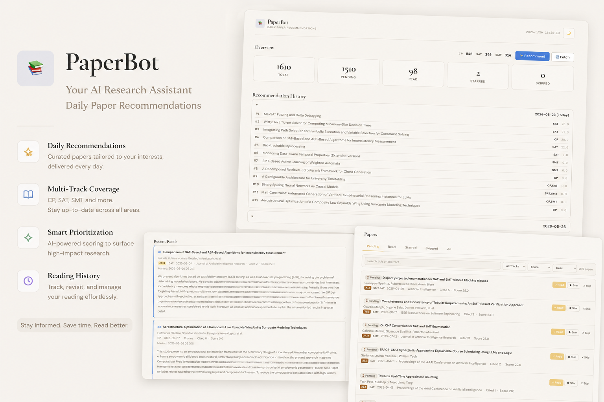

<div align="center">

# PaperBot

**Daily Paper Recommendations · Smart Filtering · One-Click Tracking**

PaperBot automatically fetches papers from [OpenAlex](https://openalex.org), filters and scores them
based on your research interests, and delivers daily picks via Web Dashboard and email.



</div>

---

## 5-Minute Quickstart

### 1. Install

```bash
git clone <repo-url> && cd PaperBot
uv pip install -e .
```

### 2. Configure

```bash
cp data/config.json.example data/config.json
```

Edit `data/config.json` and set up your **tracks** (research directions). SMT / SAT / CP are pre-configured by default.

### 3. Initialize Database

```bash
# Fetch papers from the past year
uv run paperbot init
```

### 4. Launch Dashboard

```bash
uv run paperbot serve
# Open http://localhost:8765
```

### 5. Daily Recommendations (Manual)

```bash
uv run paperbot recommend
```

---

## Feature Overview

| Feature | Description |
|---------|-------------|
| **Smart Fetching** | Auto-pull papers from OpenAlex by research direction, with deduplication and merging |
| **Scoring & Ranking** | Score papers by venue tier + citation count |
| **Web Dashboard** | Browse, search, mark status, write notes |
| **Translation** | DeepSeek API translation for titles and abstracts (auto-cached) |
| **PDF Resolution** | Multi-source open-access PDF lookup (OpenAlex → Unpaywall → arXiv → Semantic Scholar) |
| **Email Delivery** | Daily recommendation emails, supports SMTP / local sendmail |
| **Audit Logging** | All operations logged to SQLite + text log |

---

## Dashboard

The Dashboard is a single-page web app with zero extra dependencies:

- **Paper List** — Sorted by score, filterable by track / status / keywords
- **Detail Modal** — Click title to view abstract, authors, citations, BibTeX
- **Status Marking** — `read` / `starred` / `skip`, supports bulk operations
- **Personal Notes** — Save private notes per paper
- **One-Click Translation** — Chinese title and abstract translation (requires `DEEPSEEK_API_KEY`)
- **PDF Access** — Auto-resolve and redirect to open-access PDF
- **Dual Themes** — Dark / light mode, preference auto-saved

> To update the hero image: launch `uv run paperbot serve`, visit http://localhost:8765, take a screenshot, and save it to `assets/hero.png`.

---

## Command Cheatsheet

```bash
# View all commands
uv run paperbot --help

# Fetch papers (default last 45 days)
uv run paperbot fetch
uv run paperbot fetch --days 60

# Generate daily recommendations (default 3)
uv run paperbot recommend
uv run paperbot recommend --count 5

# Mark paper status
uv run paperbot mark "paper title" --status read
uv run paperbot mark "paper title" --status recommended
uv run paperbot mark "https://openalex.org/W123" --status starred

# View statistics
uv run paperbot stats

# View recent reads
uv run paperbot history --limit 10
uv run paperbot history --status recommended
uv run paperbot history --status read

# Launch Dashboard (foreground)
uv run paperbot serve --port 8765

# Launch Dashboard (daemon)
uv run paperbot serve --port 8765 --daemon

# Stop daemon Dashboard
uv run paperbot serve --stop

# View audit log
uv run paperbot audit --limit 20
uv run paperbot audit --stats
```

---

## Configuration Guide

`data/config.json` contains the following main sections:

### tracks — Research Directions

```json
"tracks": {
  "SMT": {
    "query": "\"SMT solver\" OR \"satisfiability modulo theories\"",
    "keywords": ["smt solver", "z3", "cvc5"],
    "color": "#2563eb"
  }
}
```

- `query` — Search query passed to OpenAlex
- `keywords` — Title/abstract keyword filter
- `color` — Track label color in Dashboard (optional, auto-generated if omitted)

### scoring — Scoring Rules

```json
"scoring": {
  "tiers": {
    "1": { "points": 20, "acronyms": ["CAV", "PLDI"], "phrases": ["Computer Aided Verification"] },
    "2": { "points": 10, "acronyms": ["SAS", "FMCAD"], "phrases": [] }
  },
  "citation_breakpoints": [
    { "up_to": 10, "points_per_citation": 1.0 },
    { "up_to": 50, "points_per_citation": 0.5 },
    { "up_to": null, "points_per_citation": 0.2 }
  ],
  "max_citation_points": 40
}
```

Total score = venue tier base points + citation conversion points (piecewise cumulative, capped at 40)

### recommendation — Recommendation Strategy

```json
"recommendation": {
  "daily_count": 3,          // Daily recommendation count
  "quality_slots": 1,        // Slots reserved for high-score papers
  "high_score_threshold": 5, // High score threshold
  "recent_days": 30          // Recent paper definition (days)
}
```

### mail — Email Config (Optional)

```json
"mail": {
  "smtp_host": "smtp.gmail.com",
  "smtp_port": 587,
  "smtp_user": "your-email@gmail.com",
  "smtp_password": "your-app-password",
  "from_addr": "your-email@gmail.com",
  "to_addrs": ["recipient@example.com"],
  "use_tls": true
}
```

Leave empty to use local sendmail (no configuration needed).

Environment variable overrides: `SMTP_HOST`, `SMTP_USER`, `SMTP_PASSWORD`, `SMTP_FROM`

### translate — Translation (Optional)

```bash
export DEEPSEEK_API_KEY=your_key_here
```

Translation results are automatically cached in the database — the same paper is never translated twice.

---

## Automation (Crontab)

Add the following to your crontab for fully automated daily delivery:

```bash
# Edit crontab
crontab -e

# Daily recommendations + email at 8 AM
0 8 * * * cd /path/to/PaperBot && uv run paperbot recommend --email

# Weekly fetch on Monday at 2 AM
0 2 * * 1 cd /path/to/PaperBot && uv run paperbot fetch --email
```

Use `paperbot audit --stats` to check success/failure status of each run, helpful for debugging cron issues.

---

## Project Structure

```
PaperBot/
├── data/
│   ├── config.json.example    # Config template
│   └── config.json            # Your local config (gitignored)
├── src/paperbot/
│   ├── cli.py                 # CLI entry point
│   ├── dashboard.py           # Web Dashboard (HTTP server + SPA)
│   ├── fetch.py               # OpenAlex fetcher
│   ├── recommend.py           # Recommendation engine
│   ├── translate.py           # DeepSeek translation
│   ├── pdf_resolver.py        # Multi-source PDF resolver
│   ├── db.py                  # SQLite data layer
│   ├── mail.py                # Email delivery
│   ├── audit.py               # Audit logging
│   ├── config.py              # Config loader
│   ├── models.py              # Data models
│   └── utils.py               # Utility functions
├── tests/                     # Test suite
├── pyproject.toml
└── README.md
```

---

## Testing

```bash
# Run all tests
uv run pytest tests/ -q

# Run with coverage
uv run pytest tests/ --cov=paperbot --cov-report=term-missing
```

---

## License

MIT
